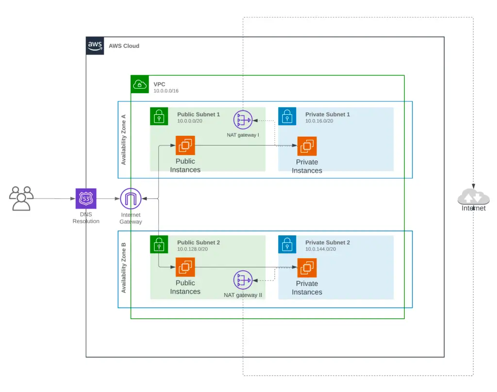

The following Terraform code will create the following components within the new VPC:
-AWS VPC
-Subnets (Includes private and public subnets in 2 availability zones).
-Internet Gateway
-NAT Gateway
-Security Groups
-Route Tables

